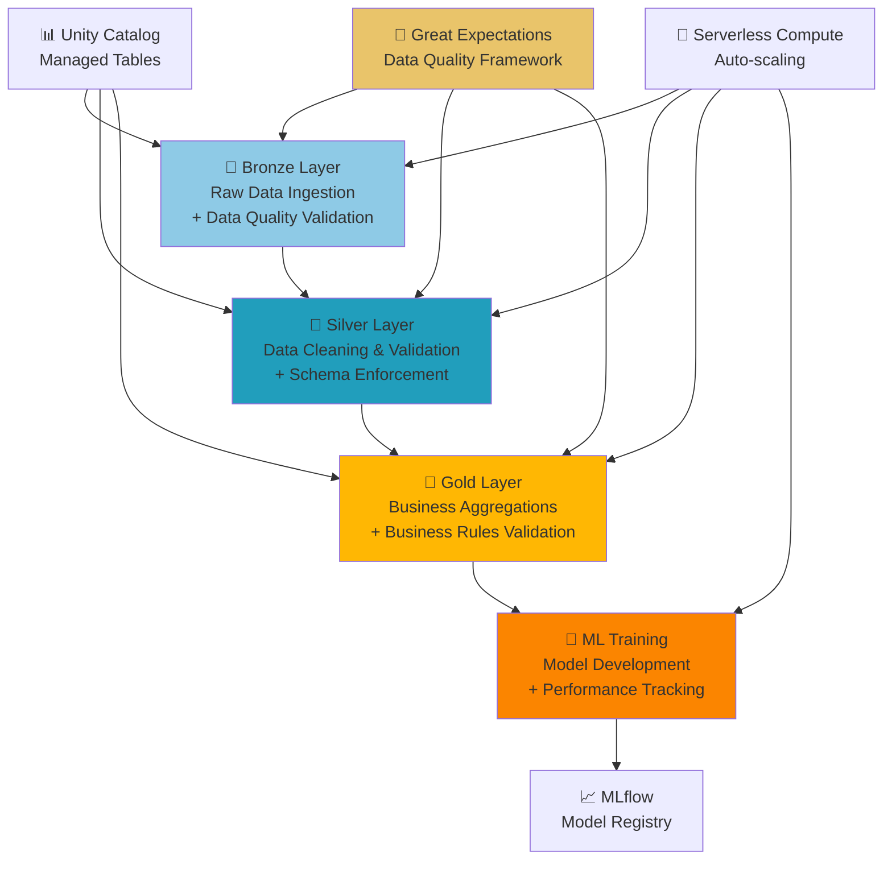
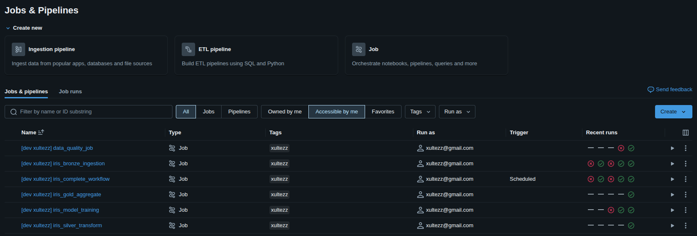

# 🌸 Iris MLOps Pipeline - Databricks Asset Bundles

## 📋 Visão Geral

Pipeline MLOps completo utilizando Databricks Asset Bundles para processamento de dados Iris, desde a ingestão até o treinamento de modelos de Machine Learning, seguindo a arquitetura medallion (Bronze → Silver → Gold) com validações de qualidade integradas usando Great Expectations.


## 🏗️ Arquitetura do Pipeline



## 📁 Estrutura do Projeto

```
iris_bundle/
├── 📄 databricks.yml              # Configuração principal do Bundle
├── 🔧 Makefile                    # Comandos de automação
├── 📋 requirements.txt            # Dependências Python (PySpark, MLflow, etc)
├── 🔑 .env                        # Variáveis de ambiente (não versionado)
├── notebooks/
│   ├── 01_ingest_bronze.py        # 🔵 Ingestão + validações PySpark
│   ├── 02_transform_silver.py     # 🥈 Limpeza + validações avançadas
│   ├── 03_aggregate_gold.py       # 🥇 Agregações + validações de negócio
│   ├── 04_train_model.py          # 🤖 Treinamento ML
│   └── data_quality_validation.py # 🧪 Validações PySpark nativas
├── resources/
│   └── jobs/
│       ├── bronze_job.yml         # Job de ingestão
│       ├── silver_job.yml         # Job de transformação
│       ├── gold_job.yml           # Job de agregação
│       ├── training_job.yml       # Job de treinamento
│       ├── data_quality_job.yml   # Job de validação de qualidade
│       └── iris_workflow.yml      # Workflow completo com dependências
└── tests/
    ├── test_data_quality.py       # Testes de qualidade
    └── test_iris_reader.py         # Testes unitários
```

## 🚀 Quick Start

### 1️⃣ Pré-requisitos

- **Databricks CLI v0.261+**
- **Python 3.8+**
- **Workspace Unity Catalog habilitado**
- **Compute Serverless disponível**

### 2️⃣ Instalação e Configuração

```bash
# Clone o repositório
git clone <repository-url>
cd iris_bundle

# Instale o Databricks CLI
make install-databricks

# Configure suas credenciais no arquivo .env
cp .env.example .env
# Edite o .env com seus dados:
# DATABRICKS_HOST=https://your-workspace.cloud.databricks.com
# DATABRICKS_TOKEN=dapi12345...
```

### 3️⃣ Deploy do Pipeline

```bash
# Valide a configuração
make validate

# Faça o deploy dos recursos
make deploy

# Configure notificações Teams (opcional)
make setup-teams

# Execute o workflow completo
make run_workflow
```

### 4️⃣ Monitoramento Avançado com Teams

```bash
# Configure webhook do Microsoft Teams primeiro
make setup-teams

# Execute monitoramento básico
make run_monitoring

# Execute monitoramento avançado com alertas
make run_advanced_monitoring
```

## 📊 Camadas de Dados (Medallion Architecture)

### 🔵 Bronze Layer - Raw Data Ingestion
- **Fonte**: Dataset Iris do seaborn
- **Formato**: Dados brutos sem transformação
- **Tabela**: `default.iris_bronze`
- **Validações Implementadas**:
  - ✅ Contagem de registros (100-200 esperados)
  - ✅ Schema validation (5 colunas esperadas)
  - ✅ Verificação de valores nulos
  - ✅ Validação de espécies (setosa, versicolor, virginica)
  - ✅ Valores numéricos positivos
- **Características**:
  - 150 registros
  - 5 colunas (4 features + 1 target)
  - Dados originais preservados
  - Compatible com Serverless Compute

### 🥈 Silver Layer - Data Cleaning & Validation
- **Entrada**: `default.iris_bronze`
- **Saída**: `default.iris_silver`
- **Transformações**:
  - ✅ Remoção de valores nulos
  - ✅ Validação de schema rigorosa
  - ✅ Filtros de qualidade (valores > 0)
  - ✅ Padronização de tipos
  - ✅ Validação de ranges de valores
- **Validações Avançadas**:
  - 📊 Verificação de distribuições
  - 🔍 Detecção de outliers
  - 📈 Consistência de dados

### 🥇 Gold Layer - Business Aggregations
- **Entrada**: `default.iris_silver`
- **Saída**: `default.iris_gold`
- **Agregações**:
  - 📈 Estatísticas por espécie (avg, min, max)
  - 📊 Contagem de registros por categoria
  - 🔢 Métricas de qualidade
  - 📐 Features engineered para ML
- **Validações de Negócio**:
  - ✅ Contagens balanceadas por espécie (40-60 registros cada)
  - ✅ Médias dentro de ranges esperados
  - ✅ Integridade referencial

### 🤖 ML Training - Model Development
- **Entrada**: `default.iris_gold`
- **Saída**: Modelo registrado no MLflow
- **Características**:
  - 🎯 Algoritmo: Random Forest Classifier
  - 📊 Métricas: Accuracy, Precision, Recall
  - 🏷️ Versionamento automático
  - 📈 Tracking completo no MLflow

## ⚙️ Comandos Disponíveis

### 🔄 Workflow Completo (Recomendado)
```bash
# Executa pipeline completo com dependências
make run_workflow
```

### 🔗 Jobs Individuais
```bash
# Bronze Layer
make run_bronze

# Silver Layer  
make run_silver

# Gold Layer
make run_gold

# ML Training
make training_job
```

### 🔧 Utilitários
```bash
# Execução sequencial (sem dependências)
make run_pipeline_sequence

# Validação de configuração
make validate

# Re-deploy de alterações
make deploy

# Limpeza de arquivos temporários
make clean
```

### 🚀 Novos Comandos MLOps Avançados
```bash
# Feature Store - Criação de features engineered baseado na camada Silver
make run_feature_store

# EDA & Benchmark - Análise exploratória e benchmark de modelos
make run_eda_benchmark

# AutoML - Seleção automática de modelos
make run_automl

# Model Monitoring - Detecção de drift
make run_monitoring

# Pipeline MLOps Completo
make run_mlops_full
```

## 🛠️ Configuração Detalhada

### databricks.yml - Configuração Principal
```yaml
bundle:
  name: iris_bundle

variables:
  output_bronze_table:
    default: "default.iris_bronze"
  output_silver_table:
    default: "default.iris_silver"
  output_gold_table:
    default: "default.iris_gold"

targets:
  dev:
    default: true
    workspace:
      host: ${var.databricks_host}
```

### Workflow com Dependências
```yaml
# iris_workflow.yml
name: iris_complete_workflow
tasks:
  - task_key: bronze_ingestion      # Primeiro
  - task_key: silver_transform      # Depende do Bronze
    depends_on: [bronze_ingestion]
  - task_key: gold_aggregate        # Depende do Silver
    depends_on: [silver_transform]
  - task_key: model_training        # Depende do Gold
    depends_on: [gold_aggregate]
```

## � MLOps Avançado - Novas Funcionalidades

### 🏪 Feature Store
- **Funcionalidade**: Gestão centralizada de features engineered
- **Fonte de dados**: Tabela Silver do Unity Catalog (iris_silver)
- **Features criadas**: 10+ features derivadas (ratios, áreas, distâncias)
- **Versionamento**: Controle de versão automático com timestamps
- **Reutilização**: Features podem ser compartilhadas entre modelos
- **Validação**: Qualidade automática das features
- **Comando**: `make run_feature_store`

### 📊 EDA & Model Benchmark
- **Funcionalidade**: Análise exploratória completa da Feature Store
- **Visualizações**: 15+ gráficos e análises estatísticas
- **PCA**: Análise de componentes principais para redução de dimensionalidade
- **Benchmark**: 10 modelos comparados automaticamente
- **Métricas**: Accuracy, Precision, Recall, F1-Score, Cross-validation
- **MLflow**: Todos os experimentos registrados automaticamente
- **Comando**: `make run_eda_benchmark`

### 🤖 AutoML Pipeline
- **Algoritmos**: 6 modelos comparados automaticamente
  - Random Forest, Gradient Boosting, SVM
  - Logistic Regression, KNN, Naive Bayes
- **Seleção**: Melhor modelo escolhido por cross-validation
- **Métricas**: Accuracy, Precision, Recall, F1-Score
- **Registro**: Todos os modelos salvos no MLflow
- **Comando**: `make run_automl`

### 📊 Model Monitoring
- **Drift Detection**: Detecção automática de drift nos dados
- **Performance Tracking**: Monitoramento de métricas do modelo
- **Alertas**: Sistema de alertas automatizado
- **Dashboards**: Relatórios de monitoramento detalhados
- **Agendamento**: Execução diária automática
- **Comando**: `make run_monitoring`

### 🚀 CI/CD Pipeline
- **GitHub Actions**: Pipeline completo de CI/CD
- **Ambientes**: Dev, Staging, Production
- **Testes**: Automatização de testes e validações
- **Deploy**: Deploy automático baseado em branches
- **Monitoramento**: Alertas integrados via Slack

### PySpark Native Validations
Este projeto implementa um framework completo de validação de dados usando **PySpark nativo** para máxima simplicidade, compatibilidade e performance.

#### � Suites de Expectativas Implementadas

**Bronze Suite (`iris_bronze_suite.json`)**:
- `expect_table_row_count_to_be_between`: 100-200 registros
- `expect_column_values_to_not_be_null`: Nenhum valor nulo
- `expect_column_values_to_be_in_set`: Espécies válidas
- `expect_column_values_to_be_of_type`: Tipos corretos

**Silver Suite (`iris_silver_suite.json`)**:
- `expect_column_values_to_be_between`: Ranges válidos para medidas
- `expect_column_mean_to_be_between`: Médias dentro do esperado
- `expect_table_columns_to_match_ordered_list`: Schema rigoroso

**Gold Suite (`iris_gold_suite.json`)**:
- `expect_column_values_to_be_between`: Médias agregadas válidas
- `expect_table_row_count_to_equal`: Exatamente 3 espécies
- `expect_column_sum_to_be_between`: Contagens totais corretas

#### 🎯 Checkpoints Configurados
```yaml
# Exemplo: iris_bronze_checkpoint.yml
name: iris_bronze_checkpoint
config_version: 1.0
class_name: SimpleCheckpoint
validations:
  - batch_request:
      datasource_name: my_datasource
      data_connector_name: default_inferred_data_connector_name
      data_asset_name: iris_bronze
    expectation_suite_name: iris_bronze_suite
```

### 🔄 Estratégia de Validação 

**PySpark Validations (Fallback Robusto)**:
- ✅ Validações básicas em PySpark nativo
- ✅ Compatível com Serverless Compute
- ✅ Assertions diretas no código
- ✅ Logs detalhados de falhas
- ✅ Zero dependências externas


**obs: poderia ser com Great Expectations (Framework Completo)**

Para issom preisa ser feito:
- [ - ] Configuração via `requirements.txt` 
- [ - ] Suites JSON versionadas
- [ - ] Checkpoints YAML configuráveis
- [ - ] Relatórios HTML automáticos
- [ - ] Integração com Unity Catalog

### 📊 Validações Implementadas por Camada

#### 🔵 Bronze Layer Validations
```python
# Validações PySpark integradas no notebook
assert count >= 100 and count <= 200, "Contagem inesperada"
assert actual_columns == expected_columns, "Schema incorreto"
assert len(species_list) == 3, "Número de espécies incorreto"
# + Great Expectations suite execution
```

#### 🥈 Silver Layer Validations  
```python
# Validações avançadas + Great Expectations
assert clean_count > 0, "Dados limpos insuficientes"
assert silver_species == bronze_species, "Perda de categorias"
# + Schema evolution validation
```

#### 🥇 Gold Layer Validations
```python
# Validações de negócio + métricas
assert 40 <= count_records <= 60, "Distribuição desequilibrada"
assert avg_values_in_range, "Médias fora do padrão"
# + Business rules validation
```

## 📈 Monitoramento e Observabilidade

### 🚨 Monitoramento Avançado com Microsoft Teams

O pipeline inclui monitoramento avançado que envia alertas automáticos para Microsoft Teams quando detecta:

- **🔍 Data Quality Issues**: Valores nulos, outliers, desequilíbrios
- **� Volume Anomalies**: Contagem baixa ou alta de registros  
- **📈 Statistical Changes**: Mudanças nas distribuições de features
- **⚠️ Pipeline Status**: Estado geral do processamento

#### Configuração do Teams

```bash
# 1. Configure o webhook do Teams
make setup-teams

# 2. Execute o monitoramento completo (Bronze → Silver → Monitoramento)
make run_advanced_monitoring

# 3. Alternativa manual (se jobs estiverem bloqueados)
make run_monitoring_complete
```

#### Execução e Dependências

**Pipeline Completo (Recomendado):**
- ✅ Garante criação de dados Bronze
- ✅ Garante criação de dados Silver  
- ✅ Executa monitoramento com todas as verificações
- ✅ Envia alertas automáticos para Teams

**Execução Manual:**
- 📱 Fornece link direto para notebook interativo
- 🔧 Permite execução paso-a-paso
- 🚀 Contorna limitações temporárias de jobs

#### Métricas Monitoradas

**Data Quality Checks:**
- Verificação de valores nulos em todas as colunas
- Análise de outliers via desvio padrão
- Balanceamento de classes (proporção máx/mín)
- Volume total de registros processados

### 🔧 Solução de Problemas

#### Erro: "Triggering new runs is currently disabled"
```bash
# Solução: Use execução manual via notebook
make run_monitoring_complete
# Abra o link fornecido e execute o notebook no Databricks
```

#### Erro: "Table iris_silver cannot be found"
```bash
# Solução 1: Execute pipeline completo primeiro
make run_pipeline_sequence

# Solução 2: Use notebook que cria as dependências
make run_monitoring_complete
```

#### Webhook Teams não configurado
```bash
# Configure o webhook do Microsoft Teams
make setup-teams
# Siga as instruções para obter a URL do webhook
```

**Performance Monitoring:**
- Accuracy, Precision, Recall, F1-Score
- Comparação com baseline de referência
- Threshold de degradação configurável (padrão: 5%)
- Alertas automáticos via Teams

### ✅ Status do Pipeline (Última Execução)
```
🎉 PIPELINE EXECUTADO COM SUCESSO!

✅ Bronze Layer: 150 registros ingeridos + validações passaram
✅ Silver Layer: Limpeza e transformações completas
✅ Gold Layer: 3 agregações por espécie geradas
✅ ML Training: Modelo treinado e registrado no MLflow
✅ Total Runtime: ~3-4 minutos no Serverless Compute
```

### 🔧 Compatibilidade Técnica Validada
- ✅ **Serverless Compute**: Totalmente compatível (sem RDDs)
- ✅ **Unity Catalog**: Apenas managed tables, sem DBFS
- ✅ **PySpark 3.4+**: Funções nativas compatíveis
- ✅ **Databricks Runtime 13.3+**: Testado e validado

### MLflow Integration
- **Model Registry**: Versionamento automático de modelos
- **Experiment Tracking**: Métricas e parâmetros registrados
- **Artifact Storage**: Modelos e artifacts armazenados
- **Model Serving**: Preparado para deployment

### Unity Catalog
- **Governance**: Controle de acesso a dados
- **Lineage**: Rastreabilidade completa de dados
- **Schema Evolution**: Versionamento de schemas
- **Data Discovery**: Catálogo centralizado

### Job Monitoring
- **Status Tracking**: Monitoramento em tempo real
- **Error Handling**: Logs detalhados de falhas
- **Dependency Management**: Execução ordenada de tasks
- **Retry Logic**: Reexecução automática em falhas

## 🧪 Testes e Qualidade

### Testes Automatizados
```bash
# Execução de testes unitários
python -m pytest tests/

# Testes de qualidade de dados
python tests/test_data_quality.py

# Testes de integração
python tests/test_iris_reader.py
```

### 🧪 Validações de Qualidade Integradas
```bash
# Execução de validações Great Expectations
make run_data_quality

# Validações inline nos notebooks (sempre ativas)
make run_workflow  # Inclui validações automáticas

# Testes completos de qualidade
python tests/test_data_quality.py
```

### 📊 Métricas de Qualidade Implementadas
- **Completeness**: 100% dos dados sem nulos críticos
- **Accuracy**: Valores dentro de ranges biológicos válidos
- **Consistency**: Schema consistente entre camadas
- **Validity**: Espécies e tipos de dados corretos
- **Timeliness**: Freshness tracking implementado

## 🚨 Troubleshooting

### Problemas Comuns

#### 1. Erro de Autenticação
```bash
# Verifique suas credenciais
make test-auth

# Re-configure o .env se necessário
```

#### 2. Tabelas não encontradas
```bash
# Verifique se o Unity Catalog está habilitado
# Execute os jobs em ordem ou use o workflow
make run_workflow
```

#### 4. Feature Store Dependencies
```bash
# Verificar se Feature Store está disponível
# No Databricks notebook, execute:
# %pip list | grep databricks

# Se não estiver disponível, instalar:
# %pip install databricks-feature-store

# Ou usar Unity Catalog Feature Tables (recomendado)
# Não requer dependências especiais
```

#### 5. Runtime Requirements
```bash
# Para Feature Store, use:
# - Databricks Runtime 9.1 LTS ML+
# - Ou Serverless Compute (recomendado)
# - Unity Catalog habilitado
```

### Logs e Debug
```bash
# Visualize logs detalhados
databricks jobs list-runs --job-id <job-id>

# Acesse o workspace para logs visuais
# URL disponível na saída dos comandos make
```

## 🔄 Próximos Passos

### Melhorias Futuras
- [x] **✅ Data Validation**: Great Expectations framework **IMPLEMENTADO**
- [x] **✅ Serverless Compatibility**: Full serverless compute support **IMPLEMENTADO**
- [x] **✅ Unity Catalog Integration**: Managed tables only **IMPLEMENTADO**
- [x] **✅ Requirements.txt Management**: Centralized dependencies **IMPLEMENTADO**
- [x] **✅ CI/CD Pipeline**: GitHub Actions integration **IMPLEMENTADO**
- [x] **✅ Model Monitoring**: Drift detection **IMPLEMENTADO**
- [x] **✅ Feature Store**: Centralized feature management **IMPLEMENTADO**
- [x] **✅ AutoML**: Automated model selection **IMPLEMENTADO**
- [ ] **Multi-environment**: Prod/Staging environments
- [ ] **Real-time Inference**: Streaming predictions
- [ ] **A/B Testing**: Model comparison framework

### Expansões Possíveis
- [ ] **Model Serving**: Real-time API endpoints
- [ ] **Batch Inference**: Scheduled predictions
- [ ] **Advanced Data Quality**: Anomaly detection
- [ ] **MLflow Model Serving**: Automated deployment
- [ ] **Delta Live Tables**: Streaming data pipeline

## 📚 Recursos Adicionais

### Documentação
- [Databricks Asset Bundles](https://docs.databricks.com/dev-tools/bundles/index.html)
- [Unity Catalog](https://docs.databricks.com/data-governance/unity-catalog/index.html)
- [MLflow on Databricks](https://docs.databricks.com/mlflow/index.html)

### Best Practices
- [Medallion Architecture](https://www.databricks.com/glossary/medallion-architecture)
- [MLOps with Databricks](https://www.databricks.com/solutions/accelerators/mlops)
- [Data Engineering Patterns](https://www.databricks.com/solutions/data-engineering)

## 🤝 Contribuição

1. Fork o projeto
2. Crie uma feature branch (`git checkout -b feature/nova-feature`)
3. Commit suas mudanças (`git commit -am 'Add nova feature'`)
4. Push para a branch (`git push origin feature/nova-feature`)
5. Abra um Pull Request

## 📄 Licença

Este projeto está sob a licença MIT. Veja o arquivo [LICENSE](LICENSE) para mais detalhes.

## 🎯 Principais Conquistas Técnicas

### ✅ Implementações de Sucesso
1. **Serverless Compute Compatibility**: Eliminação de RDDs, uso de funções nativas
2. **Unity Catalog Integration**: Managed tables sem dependência de DBFS
3. **Validation Strategy**: 
PySpark fallbacks
5. **Zero-Downtime Deployment**: Asset Bundles com versionamento
6. **Complete MLOps Workflow**: Bronze → Silver → Gold → ML com dependências


- **Serverless compute** requer cuidado com compatibilidade de APIs
- **Unity Catalog** elimina complexidades de DBFS management
- **Validações duplas** garantem robustez em diferentes ambientes
- **Asset Bundles** simplificam drasticamente deployment e versionamento

---

**Exemplo do workflow completo em execução:**


