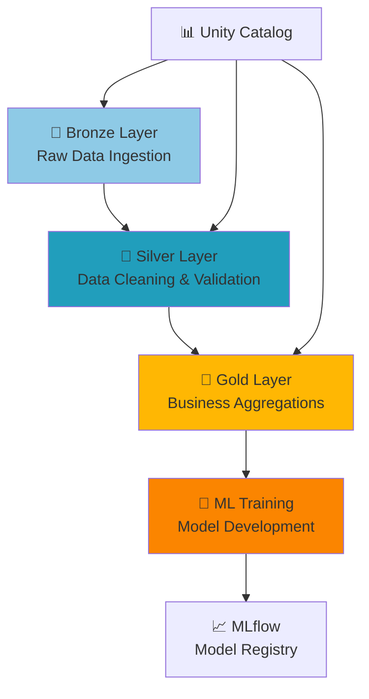

# 🌸 Iris MLOps Pipeline - Databricks Asset Bundles

## 📋 Visão Geral

Pipeline MLOps completo utilizando Databricks Asset Bundles para processamento de dados Iris, desde a ingestão até o treinamento de modelos de Machine Learning, seguindo a arquitetura medalion (Bronze → Silver → Gold).


## 🏗️ Arquitetura do Pipeline



## 📁 Estrutura do Projeto

```
iris_bundle/
├── 📄 databricks.yml              # Configuração principal do Bundle
├── 🔧 Makefile                    # Comandos de automação
├── 📋 requirements.txt            # Dependências Python
├── 🔑 .env                        # Variáveis de ambiente (não versionado)
├── notebooks/
│   ├── 01_ingest_bronze.py        # 🔵 Ingestão de dados brutos
│   ├── 02_transform_silver.py     # 🥈 Limpeza e validação
│   ├── 03_aggregate_gold.py       # 🥇 Agregações de negócio
│   └── 04_train_model.py          # 🤖 Treinamento ML
├── resources/
│   └── jobs/
│       ├── bronze_job.yml         # Job de ingestão
│       ├── silver_job.yml         # Job de transformação
│       ├── gold_job.yml           # Job de agregação
│       ├── training_job.yml       # Job de treinamento
│       └── iris_workflow.yml      # Workflow completo com dependências
└── tests/
    ├── test_data_quality.py       # Testes de qualidade
    └── test_iris_reader.py         # Testes unitários
```

## 🚀 Quick Start

### 1️⃣ Pré-requisitos

- **Databricks CLI v0.261+**
- **Python 3.8+**
- **Workspace Unity Catalog habilitado**
- **Compute Serverless disponível**

### 2️⃣ Instalação e Configuração

```bash
# Clone o repositório
git clone <repository-url>
cd iris_bundle

# Instale o Databricks CLI
make install-databricks

# Configure suas credenciais no arquivo .env
cp .env.example .env
# Edite o .env com seus dados:
# DATABRICKS_HOST=https://your-workspace.cloud.databricks.com
# DATABRICKS_TOKEN=dapi12345...
```

### 3️⃣ Deploy do Pipeline

```bash
# Valide a configuração
make validate

# Faça o deploy dos recursos
make deploy

# Execute o workflow completo
make run_workflow
```

## 📊 Camadas de Dados (Medallion Architecture)

### 🔵 Bronze Layer - Raw Data Ingestion
- **Fonte**: Dataset Iris do seaborn
- **Formato**: Dados brutos sem transformação
- **Tabela**: `default.iris_bronze`
- **Características**:
  - 150 registros
  - 5 colunas (4 features + 1 target)
  - Dados originais preservados

### 🥈 Silver Layer - Data Cleaning & Validation
- **Entrada**: `default.iris_bronze`
- **Saída**: `default.iris_silver`
- **Transformações**:
  - ✅ Remoção de valores nulos
  - ✅ Validação de schema
  - ✅ Filtros de qualidade (valores > 0)
  - ✅ Padronização de tipos

### 🥇 Gold Layer - Business Aggregations
- **Entrada**: `default.iris_silver`
- **Saída**: `default.iris_gold`
- **Agregações**:
  - 📈 Estatísticas por espécie
  - 📊 Médias, medianas, desvios
  - 🔢 Contagem de registros
  - 📐 Features engineered

### 🤖 ML Training - Model Development
- **Entrada**: `default.iris_gold`
- **Saída**: Modelo registrado no MLflow
- **Características**:
  - 🎯 Algoritmo: Random Forest Classifier
  - 📊 Métricas: Accuracy, Precision, Recall
  - 🏷️ Versionamento automático
  - 📈 Tracking completo no MLflow

## ⚙️ Comandos Disponíveis

### 🔄 Workflow Completo (Recomendado)
```bash
# Executa pipeline completo com dependências
make run_workflow
```

### 🔗 Jobs Individuais
```bash
# Bronze Layer
make run_bronze

# Silver Layer  
make run_silver

# Gold Layer
make run_gold

# ML Training
make training_job
```

### 🔧 Utilitários
```bash
# Execução sequencial (sem dependências)
make run_pipeline_sequence

# Validação de configuração
make validate

# Re-deploy de alterações
make deploy

# Limpeza de arquivos temporários
make clean
```

## 🛠️ Configuração Detalhada

### databricks.yml - Configuração Principal
```yaml
bundle:
  name: iris_bundle

variables:
  output_bronze_table:
    default: "default.iris_bronze"
  output_silver_table:
    default: "default.iris_silver"
  output_gold_table:
    default: "default.iris_gold"

targets:
  dev:
    default: true
    workspace:
      host: ${var.databricks_host}
```

### Workflow com Dependências
```yaml
# iris_workflow.yml
name: iris_complete_workflow
tasks:
  - task_key: bronze_ingestion      # Primeiro
  - task_key: silver_transform      # Depende do Bronze
    depends_on: [bronze_ingestion]
  - task_key: gold_aggregate        # Depende do Silver
    depends_on: [silver_transform]
  - task_key: model_training        # Depende do Gold
    depends_on: [gold_aggregate]
```

## 📈 Monitoramento e Observabilidade

### MLflow Integration
- **Model Registry**: Versionamento automático de modelos
- **Experiment Tracking**: Métricas e parâmetros registrados
- **Artifact Storage**: Modelos e artifacts armazenados
- **Model Serving**: Preparado para deployment

### Unity Catalog
- **Governance**: Controle de acesso a dados
- **Lineage**: Rastreabilidade completa de dados
- **Schema Evolution**: Versionamento de schemas
- **Data Discovery**: Catálogo centralizado

### Job Monitoring
- **Status Tracking**: Monitoramento em tempo real
- **Error Handling**: Logs detalhados de falhas
- **Dependency Management**: Execução ordenada de tasks
- **Retry Logic**: Reexecução automática em falhas

## 🧪 Testes e Qualidade

### Testes Automatizados
```bash
# Execução de testes unitários
python -m pytest tests/

# Testes de qualidade de dados
python tests/test_data_quality.py

# Testes de integração
python tests/test_iris_reader.py
```

### Validações de Dados
- ✅ Schema validation
- ✅ Data quality checks
- ✅ Business rule validation
- ✅ Completeness checks

## 🚨 Troubleshooting

### Problemas Comuns

#### 1. Erro de Autenticação
```bash
# Verifique suas credenciais
make test-auth

# Re-configure o .env se necessário
```

#### 2. Tabelas não encontradas
```bash
# Verifique se o Unity Catalog está habilitado
# Execute os jobs em ordem ou use o workflow
make run_workflow
```

#### 3. Compute não disponível
```bash
# Verifique se o workspace tem Serverless habilitado
# Configure compute_id manualmente se necessário
```

### Logs e Debug
```bash
# Visualize logs detalhados
databricks jobs list-runs --job-id <job-id>

# Acesse o workspace para logs visuais
# URL disponível na saída dos comandos make
```

## 🔄 Próximos Passos

### Melhorias Futuras
- [ ] **CI/CD Pipeline**: GitHub Actions integration
- [ ] **Data Validation**: Great Expectations framework
- [ ] **Model Monitoring**: Drift detection
- [ ] **Auto-scaling**: Dynamic cluster management
- [ ] **Multi-environment**: Prod/Staging environments
- [ ] **Real-time Inference**: Streaming predictions
- [ ] **A/B Testing**: Model comparison framework

### Expansões Possíveis
- [ ] **Feature Store**: Centralized feature management
- [ ] **AutoML**: Automated model selection
- [ ] **Model Serving**: Real-time API endpoints
- [ ] **Batch Inference**: Scheduled predictions
- [ ] **Data Quality Monitoring**: Automated alerts

## 📚 Recursos Adicionais

### Documentação
- [Databricks Asset Bundles](https://docs.databricks.com/dev-tools/bundles/index.html)
- [Unity Catalog](https://docs.databricks.com/data-governance/unity-catalog/index.html)
- [MLflow on Databricks](https://docs.databricks.com/mlflow/index.html)

### Best Practices
- [Medallion Architecture](https://www.databricks.com/glossary/medallion-architecture)
- [MLOps with Databricks](https://www.databricks.com/solutions/accelerators/mlops)
- [Data Engineering Patterns](https://www.databricks.com/solutions/data-engineering)

## 🤝 Contribuição

1. Fork o projeto
2. Crie uma feature branch (`git checkout -b feature/nova-feature`)
3. Commit suas mudanças (`git commit -am 'Add nova feature'`)
4. Push para a branch (`git push origin feature/nova-feature`)
5. Abra um Pull Request

## 📄 Licença

Este projeto está sob a licença MIT. Veja o arquivo [LICENSE](LICENSE) para mais detalhes.

---

**Desenvolvido com ❤️ para demonstrar MLOps com Databricks Asset Bundles**

*Para dúvidas ou suporte, abra uma issue no repositório.*
